        
     
     
    

<!--- ------------------------------------------------------------------------------------------------------------------------------------------------------ -->
<!--- -- Custom Designed Banner ---------------------------------------------------------------------------------------------------------------------------- -->
<!--- -------------------------------------------------------------------------

Latest Blog Posts

    You can find my recommended blogs at [https://dev-walbarello.netlify.app/]

<!--- ------------------------------------------------------------------------------------------------------------------------------------------------------ -->
<!--- -- Visitor Badge + Links ----------------------------------------------------------------------------------------------------------------------------- -->
<!--- ------------------------------------------------------------------------------------------------------------------------------------------------------ -->

  
    
<!--    -->
  

 

<!--- ------------------------------------------------------------------------------------------------------------------------------------------------------ -->
<!--- -- About ME  --------------------------------------------------------------------------------------------------------------------------------------- -->
<!--- ------------------------------------------------------------------------------------------------------------------------------------------------------ -->

<!--- ------------------------------------------------------------------------------------------------------------------------------------------------------ -->
<!--- -- Skills Section ------------------------------------------------------------------------------------------------------------------------------------ -->
<!--- ------------------------------------------------------------------------------------------------------------------------------------------------------ -->

# Skills  

| Category        | Skills        |
|-----------------|---------------|
| Frameworks|       |
| Languages       |       |
| Styling & Frameworks |      |
| Database |       |
| Services & Tools|     |
| Competitive Coding |    |
| IDE & Environment |       |
| Hosting         |      |
| APIs |     |
| Design Tools    |     |
| Learning |      |
  

 

<!--- ------------------------------------------------------------------------------------------------------------------------------------------------------ -->
<!--- -- Projects Section ---------------------------------------------------------------------------------------------------------------------------------- -->
<!--- ------------------------------------------------------------------------------------------------------------------------------------------------------ -->
&nbsp;

 

<!--- ------------------------------------------------------------------------------------------------------------------------------------------------------ -->
<!--- -- Metrics ------------------------------------------------------------------------------------------------------------------------------------------- -->
<!--- ------------------------------------------------------------------------------------------------------------------------------------------------------ -->

# My GitHub Metrics

  
Expand
 

| Overview | Follow up Issues & PRs |
|:--------:|:-------------------------:|
|  |  |
| Leetcode Stats | Notable Contributions |
|  |  |
| Achievements | Language Activity |
|  |  |
| Discussions | Reactions |
|  |  |

                     
 

<!--- ------------------------------------------------------------------------------------------------------------------------------------------------------ -->
<!--- -- My Socials ---------------------------------------------------------------------------------------------------------------------------------------- -->
<!--- ------------------------------------------------------------------------------------------------------------------------------------------------------ -->

#  My socials

<!--- ------------------------------------------------------------------------------------------------------------------------------------------------------ -->
<!--- -- Support Me Here ----------------------------------------------------------------------------------------------------------------------------------- -->
<!--- ------------------------------------------------------------------------------------------------------------------------------------------------------ -->

#  Sponsor me 

> buy me a coffe: [sponsors page](https://github.com/sponsors/walbarellos) for further details.

 

  

<!--- ------------------------------------------------------------------------------------------------------------------------------------------------------ -->
<!--- -- GitHub Stats ------------------------------------------------------------------------------------------------------------------------------------ -->
<!--- ------------------------------------------------------------------------------------------------------------------------------------------------------ -->

|  |  |
| -- | -- |

<!--- ------------------------------------------------------------------------------------------------------------------------------------------------------ -->
<!--- -- Snake Contribution Graph -------------------------------------------------------------------------------------------------------------------------- -->
<!--- ------------------------------------------------------------------------------------------------------------------------------------------------------ -->

